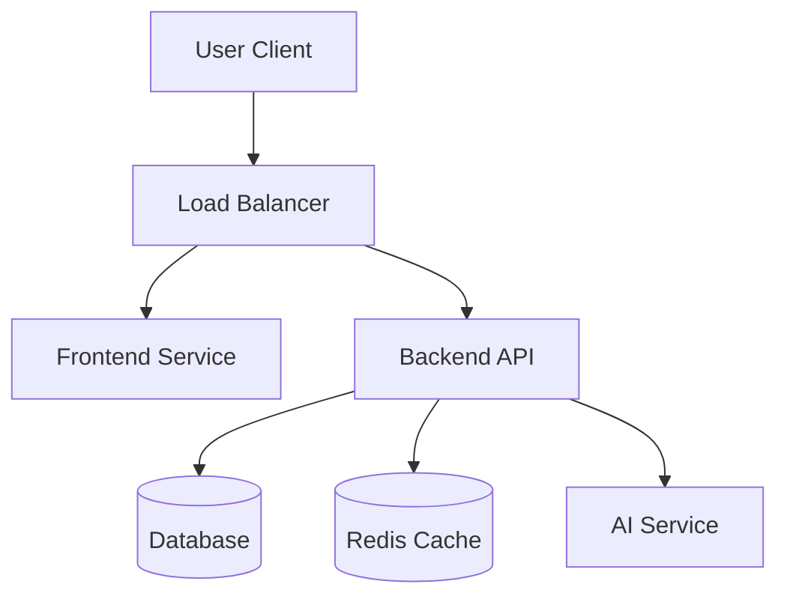

# 🏗️ UNIVERSAL BLUEPRINT V2026.02 (THE ULTIMATE STANDARD)

**Project:** [PROJECT_NAME]  
**Version:** 1.0.0  
**Status:** DRAFT / ACTIVE  
**Last Updated:** 2026-02-17  
**Architecture:** [Monolith / Microservices / Serverless / Jamstack]

---

## 🚨 MANDATORY PREAMBLE (AI INSTRUCTIONS)

**TO ALL AI AGENTS:**
1. **READ THIS FIRST:** This document is the SOURCE OF TRUTH.
2. **NO DEVIATION:** Follow the architecture and stack defined here.
3. **UPDATE ON CHANGE:** If architecture changes, update this file FIRST.
4. **500+ LINES:** This file must grow to be the comprehensive knowledge base of the project.

---

## 1. 🎯 STRATEGY & VISION

### 1.1 Core Value Proposition
*What does this project solve? Why does it exist?*
- **Problem:** [Describe the problem]
- **Solution:** [Describe the solution]
- **USP:** [Unique Selling Point]

### 1.2 Target Audience
- **Primary:** [User Persona A]
- **Secondary:** [User Persona B]

### 1.3 Success Metrics (KPIs)
- [ ] Metric 1 (e.g., < 100ms latency)
- [ ] Metric 2 (e.g., 1000 concurrent users)
- [ ] Metric 3 (e.g., 99.9% uptime)

---

## 2. 🏛️ ARCHITECTURE & STACK (FEBRUARY 2026 STANDARD)

### 2.1 Tech Stack (Select applicable)

| Layer | Technology | Reason |
|-------|------------|--------|
| **Frontend** | [React 19 / Next.js 15 / Vue 3] | Performance & Ecosystem |
| **Backend** | [Node.js 22 / Python 3.12 / Go 1.24] | Scalability |
| **Database** | [PostgreSQL 17 / MongoDB 8 / Redis 8] | Reliability |
| **Infra** | [Docker / K8s / Serverless] | Portability |
| **AI** | [Gemini 2.0 / GPT-5 / Claude 3.7] | Intelligence |

### 2.2 System Diagram (Mermaid)



### 2.3 Directory Structure (Standardized)

```
/
├── .config/            # Configuration files
├── src/                # Source code
│   ├── components/     # UI Components
│   ├── core/           # Business Logic / Domain
│   ├── api/            # API Endpoints
│   └── lib/            # Shared Utilities
├── docs/               # Documentation (Trinity Standard)
├── tests/              # Automated Tests
├── Docker/             # Docker configurations
├── BLUEPRINT.md        # THIS FILE
└── AGENTS.md           # AI Mandates
```

---

## 3. 🔌 INTEGRATION & API

### 3.1 External Services (INTEGRATION.md)
*List all 3rd party APIs here.*
- **Auth:** [Auth0 / Supabase / NextAuth]
- **Payments:** [Stripe / PayPal]
- **Email:** [Resend / SendGrid]

### 3.2 API Design Principles
- **Protocol:** [REST / GraphQL / gRPC]
- **Auth:** Bearer Token (JWT)
- **Versioning:** URI Versioning (`/api/v1/...`)

---

## 4. 🛡️ SECURITY & COMPLIANCE

### 4.1 Security Mandates
- **Zero Trust:** Verify every request.
- **Secrets:** NEVER commit `.env`. Use Vault or Environment Variables.
- **Sanitization:** Input validation (Zod/Pydantic) on ALL endpoints.

### 4.2 Compliance
- [ ] GDPR (Europe)
- [ ] CCPA (California)
- [ ] SOC2 (Enterprise)

---

## 5. 🚀 DEPLOYMENT & CI/CD

### 5.1 Pipeline
1. **Lint & Test:** Run on every commit.
2. **Build:** Docker container creation.
3. **Deploy:** Blue/Green deployment to [AWS/Vercel/DigitalOcean].

### 5.2 Environments
- **Dev:** Localhost / Feature Branch
- **Staging:** Mirror of Prod
- **Prod:** Live System

---

## 6. 🧪 TESTING STRATEGY

### 6.1 Testing Pyramid
- **Unit:** 80% Coverage (Jest/Vitest/Pytest)
- **Integration:** API & DB flows
- **E2E:** Critical User Paths (Playwright)

---

## 7. 📝 DOCUMENTATION (TRINITY STANDARD)

- **`README.md`**: Entry point (Quick start).
- **`BLUEPRINT.md`**: Architecture & Truth.
- **`AGENTS.md`**: AI Rules & Mandates.
- **`docs/`**: Detailed guides.

---

## 8. 🔄 MAINTENANCE & OPERATIONS

### 8.1 Monitoring
- **Logs:** [Loki / Datadog]
- **Metrics:** [Prometheus / Grafana]
- **Alerts:** [PagerDuty / Slack]

### 8.2 Backup Strategy
- **Database:** Daily snapshots, retained for 30 days.
- **Assets:** S3 Versioning enabled.

---

## 9. 🧠 AI AGENT WORKFLOWS

### 9.1 Sisyphus Protocol
- **Role:** Lead Architect & Implementer.
- **Mode:** Parallel execution.
- **Rule:** Always verify before committing.

### 9.2 Context Preservation
- **`lastchanges.md`**: Update after every session.
- **`userprompts.md`**: Log user intent.

---

*Generated by Sisyphus - The Ultimate Blueprint Standard 2026*
